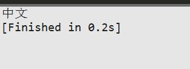
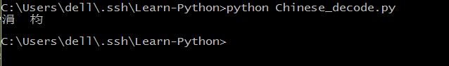
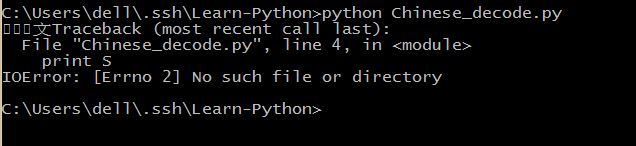
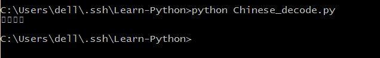

#Learn-Python
This is my Python demo

##关于编码
==

[TOC]

>本来只是准备简单的写一写，结果发现越写越多。

正好最近在知乎看到一道题目，中国的程序员与美国的程序员的差别在哪里，其他的方面不敢说，在字符编码这个问题上，估计大部分的中国程序员都遇到过，而且肯定认知比美国的程序员更深刻。。。  

这里相关的程序运行背景也有必要先说明一下。  
- Python2.7
- sublime_text 2 有时候也在cmd中执行
- Windows 10

##几点基础知识
- 编码格式有ASCII，GBK，gb2312，UTF-8，Unicode，在MySQL里还有utf8，在Windows下还有cp936。其中，除了ASCII，其他都是能够显示中文的，只不过兼容或者不兼容的问题。  
>- Unicode是一种字符集，它为古代或现代使用的文字系统中出现的每一个字符都提供了统一的序列号，规定了符号的二进制代码，但没有规定这个二进制代码该如何存储。也就是说，Unicode的编码方式是固定的，但是实现方式根据需要有很多种，常见的有UTF-8，UTF-16和UTF-32等。
>- gb2312是中国政府在
>Windows下中文的默认编码格式是cp936，即GBK编码，只有几十个汉字的区别。但是在PHP下会被识别为cp936，不过个人建议还是使用UTF-8编码。
>- utf-8的编码格式比GBK的编码格式实在好太多了，在Linux和Mac下默认的中文编码格式就是UTF-8，而且全世界通用，强烈建议在任何情况下都将其他的编码格式转化为UTF-8。
- Python 2.X 的版本与Python 3.X的版本差别有很多。其中有一点就是Python 2.X默认编码ASCII ， 而Python 3.X默认编码UTF-8。  
- 但是在Python代码中做编码转换的时候，却需要先将其他的编码格式解码(decode)为Unicode，再从Unicode编码(encode)为另一种格式，不能直接在两种不同的编码格式之间转换，比如说GBK和UTF-8。   
 - decode作用是将其他编码格式的字符串转化为Unicode编码，比如`str.decode('gb2312')`是指将gb2312编码的字符串转化为Unicode编码。
 - encode作用是将Unicode编码的字符串转化为其他编码格式，比如`str.encode('utf-8')`是指将Unicode编码的字符串转化为utf-8编码。
 - Unicode
- 因为Python 2.X的默认编码格式是ASCII，那么在没有指定Python源码编码格式的情况下，源码中所有字符都会被默认 为ASCII码。
- sublime_text中默认的编码格式是utf-8，而且不能正确识别GBK编码的中文，如果需要能够识别GBK编码的中文，需要安装GBK Encoding Support 插件，但是即便如此，在打开GBK格式编码的中文文件时，sublime会自动生成一个dump文件，文件修改过程中，不会修改原文件，只有按"保存"了才会将dump的数据更新到原文件里，关闭当前编辑的dump文件则会自动删除dump文件。

##常见的编码错误
- SyntaxError: Non-ASCII character
这种异常最不容易出现，也最容易处理，主要原因是Python源码文件中有非ASCII字符，而且同时没有声明源码编码格式,如：
```python
S = "中文"
print S
```
即会抛出语法错误，有非ASCII字符在代码中出现，但是没有设定编码方式。这个错误在文件中sublime_text中写好代码后，无论是用sublime_text执行还是用cmd执行都会报这个错。
`SyntaxError: Non-ASCII character '\xe4' in file C:\Users\dell\.ssh\Python_Lib\Chinese_decode.py on line 1, but no encoding declared; see http://python.org/dev/peps/pep-0263/ for details
`   
**解决方法：**在代码头声明编码格式。
```python
#coding=utf-8
#或者这样写也可以
# -*- coding: utf-8 -*-
S = "中文"
print S
```
这样在sublime_text中即能够正确显示，但是在cmd中能够显示出来，只不过是乱码。
   
   
这是因为在Windows下中文的默认编码格式为cp936，所以即使我们设定了编码格式为UTF-8，utf-8编码格式的中文也不能再cp936格式下正常显示。可以在cmd中输入`chcp`来查看当前字符集编码格式，使用`chcp 65001`来将Windows默认中文编码格式临时改为UTF-8。
但是在这里我再次尝试时出现了问题。  

这是为什么呢？找不到这个文件？看来还是文件编码不对，在sublime中将这个代码文件的编码格式改为GBK再试试。

虽然找到了，但是这回字符又找不到了。将Windows的默认编码格式换回去。

这是什么情况，虽然这样可以看到了，但是因为编码格式不是UTF-8，在sublime中不是编辑代码源文件了，而是dump的临时文件，这样看起来非常的不舒服。那我们再换回去。然而换回去的话，在cmd中显示的图片就和我们一开始在cmd中看到的乱码一样了，这样要怎么解决呢？   
还有，有时候或许是在Python代码的注释中混有中文，效果也是和以上一样。
- 


